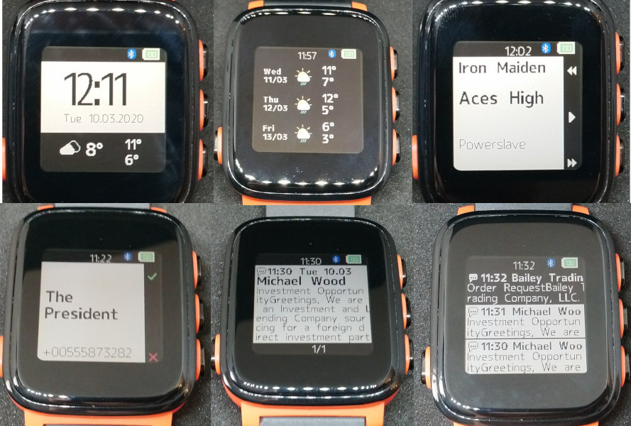

# SMA-Q2-OSS

Open source firmware for the SMA-Q2 smartwatch.

[Project page on hackaday.io](https://hackaday.io/project/85463-color-open-source-smartwatch)

The firmware aims to be a drop-in replacement for the original firmware. No additional hardware is required. It can be uploaded using the original OTA bootloader.

To maintain compatibility with the softdevice and bootloader already on the watch, this firmware is based on nRF5 SDK version 11.0.

## Current status

  * Shows time
  * Over 10-day battery life with BLE connected
  * BLE communication secured with passkey comparison pairing
  * Current weather and forecast
  * Music player control
  * Call notifications
  * Message notifications with message history
  * Gadgetbridge support
  * Vibration works
  * Backlight based on accelerometer orientation or tapping
  * Heart rate monitor works, but doesn't use the proprietary algorithm lib, so the results are not very useful

## Smartphone app

[Gadgetbridge fork](https://github.com/Emeryth/Gadgetbridge)

## Building

1. Download nRF5 SDK 11.0 and copy the sdk `components` folder to the project folder
2. Edit `components/toolchain/gcc/Makefile.posix` or `Makefile.windows` to point to your toolchain
2. Install `nrfutil` version **0.5.2**
3. Patch the TWI driver to allow transfers longer than 255 bytes:

        cd components/drivers_nrf/
        patch -s -p0 < ../../patch/twi.patch

4. Go to `armgcc` and run `make`
5. Resulting `app_dfu_package.zip` can be uploaded using regular Nordic DFU software

## Flashing

### Via DFU
The watch can be flashed using regular Nordic DFU software, like nRF Connect for Android.

To enter the built-in OTA bootloader:

**Original firmware:**
 hold UP and DOWN buttons while powering on the watch.

**This firmware:**
 press UP, DOWN and BACK at the same time

### Via SWD
Enabling SWD requires some work:

1. Upload a firmware that dumps the flash and configuration register contents
2. Disassemble watch
3. Connect to SWD and unlock device **this erases the entire flash!**
4. Restore the bootloader/softdevice/firmware and configuration register values
5. Disable CRC checking in bootloader

## License and Copyright

Copyright (c) 2019 Andrzej Surowiec,
released under MIT License 

FreeRTOS Copyright (C) Amazon.com, Inc.

nRF GFX lib Copyright (c) Nordic Semiconductor ASA

CMSIS DSP lib Copyright (C) ARM Limited. 

utf8proc lib Copyright (c) Steven G. Johnson, Jiahao Chen, Peter Colberg, Tony Kelman, Scott P. Jones, and other contributors.

nanopb Copyright (c) Petteri Aimonen

micro-ecc lib Copyright (c) Kenneth MacKay

See headers for licenses.

## Contact
Feel free to contact us on Freenode IRC channel [#smaq2oss](irc://chat.freenode.net/smaq2oss).